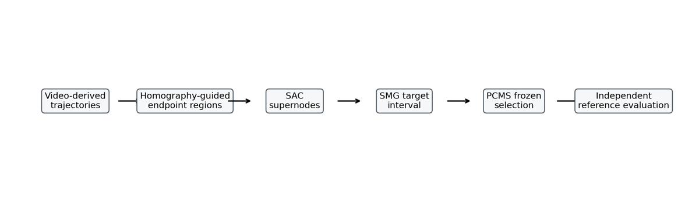
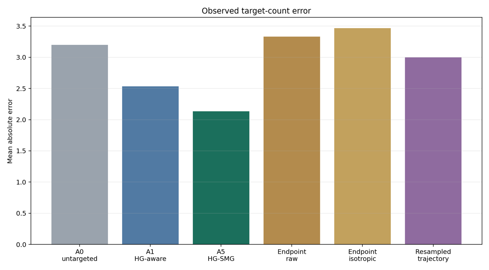
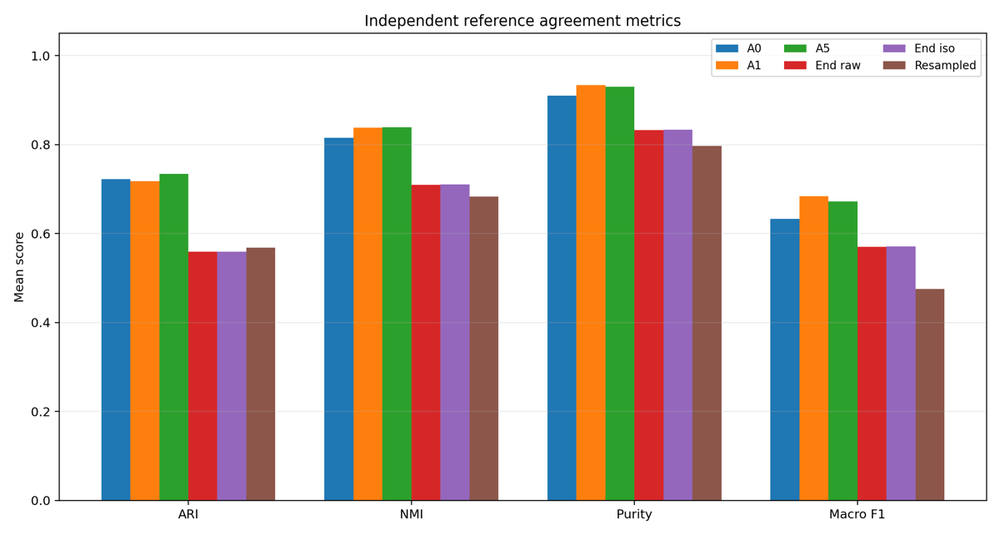
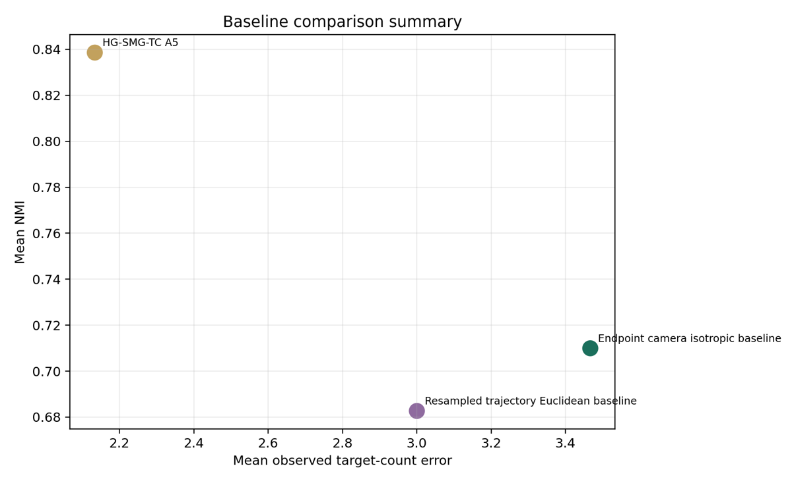
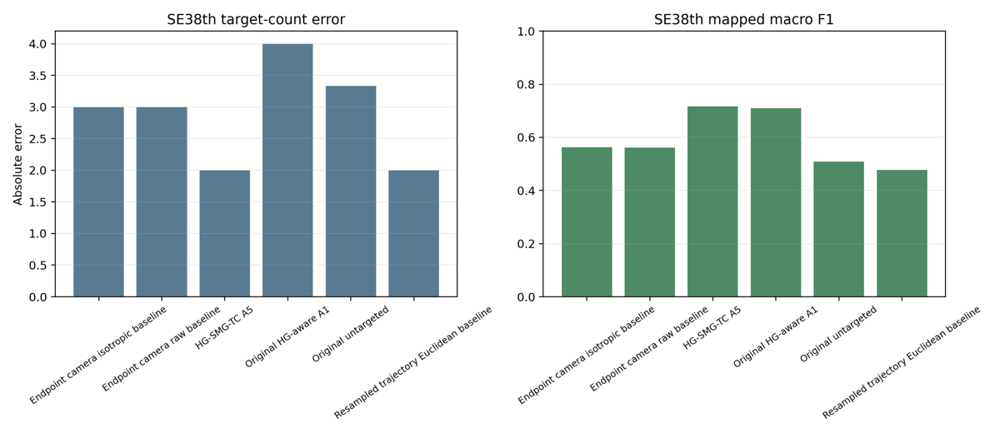

# From Geometric Endpoint Micro-Modes to Semantic Maneuver Graphs

**Homography-Guided Vehicle Trajectory Clustering at Complex Urban Intersections**

This page summarizes the Future Transportation revision package for HG-SMG-TC: **Homography-Guided Semantic Maneuver Graph Trajectory Clustering**.

Expected public URL after GitHub Pages integration:

`https://aronagg.github.io/PathFindRNET_2.0/publications/hg-smg-tc/`

## Release Links

- GitHub repository: `https://github.com/aronagg/PathFindRNET_2.0`
- Publication package: `publications/hg-msa-tc-future-transportation/`
- Public OneDrive data folder: `https://onedrive.live.com/?redeem=aHR0cHM6Ly8xZHJ2Lm1zL2YvYy84MGZhYWQ2ZmVhMDViMDhjL0lnQlBxblBYemRWd1I1NERrbHVfUzB0bkFUMWJFUlBzSk1XTHM3TVJ3ZDNPZFRJP2U9b2NpOXBM&id=80FAAD6FEA05B08C%21sd773aa4fd5cd47709e03925bbf4b4b67&cid=80FAAD6FEA05B08C`

## Summary

HG-SMG-TC connects homography-guided endpoint micro-mode discovery with semantic approach consolidation, semantic maneuver graph construction, uncertainty-aware maneuver-count priors and prior-constrained model selection. The method is evaluated on five Bellevue intersections using a leakage-controlled split protocol and exhaustive human-defined polygon-rule-based reference labels.

## Dataset and Split Summary

The study uses five Bellevue scenes only:

- `bellevue_116th_ne12th`
- `bellevue_150th_newport`
- `bellevue_150th_eastgate`
- `bellevue_150th_se38th`
- `bellevue_ne8th`

The split roles are target estimation, model selection and locked independent test. Independent-test labels are read only after cluster assignments are persisted.

## Pipeline Overview



## Locked-Test Result Summary

| Method family | Target error | NMI | Macro F1 | Outlier % |
| --- | ---: | ---: | ---: | ---: |
| Original untargeted A0 | 3.2000 | 0.8155 | 0.6328 | 15.56 |
| Original HG-aware A1 | 2.5333 | 0.8376 | 0.6838 | 9.94 |
| HG-SMG-TC A5 | 2.1333 | 0.8386 | 0.6723 | 10.34 |
| Endpoint isotropic baseline | 3.4667 | 0.7099 | 0.5710 | 24.43 |
| Resampled trajectory baseline | 3.0000 | 0.6827 | 0.4752 | 25.02 |

The results support a conservative trade-off interpretation. HG-SMG-TC improves mean observed target-count alignment and slightly improves NMI relative to the original HG-aware method, but it does not improve every metric.

## Key Figures









## Reproducibility

Start with:

- `publications/hg-msa-tc-future-transportation/README.md`
- `publications/hg-msa-tc-future-transportation/REPRODUCIBILITY.md`
- `publications/hg-msa-tc-future-transportation/DATA_AVAILABILITY.md`

Core synthesis regeneration:

```powershell
.\publications\hg-msa-tc-future-transportation\scripts\reproduce_core_results.ps1
```

## License and Provenance Notes

Raw videos and large detector/tracking artifacts belong in the public OneDrive data folder, not in Git history. Google-derived or third-party map imagery should not be redistributed unless licensing and attribution are confirmed. Public materials should rely on source code, compact metrics, calibration tables, generated figures and author-created diagrams.

[Back to PathFindRNET 2.0](../../../)
